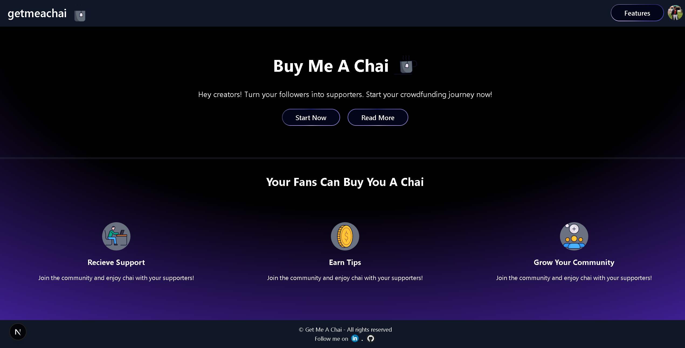
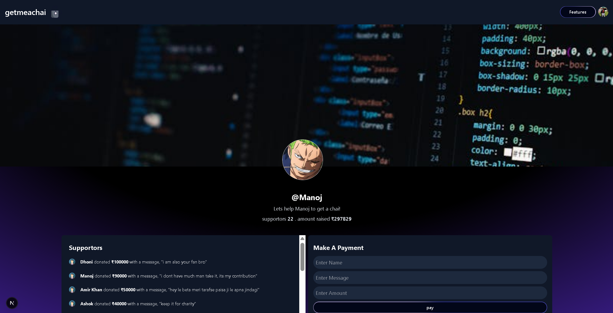

# ☕ Get Me A Chai – Tipping Platform

A simple, secure, and customizable tipping platform where creators, developers, and freelancers can receive support via Razorpay — without any login required for contributors.

---

## 🖼️ Screenshots

### 🏠 Home Page



---

### 💸 Payment Page



---

## ✨ Features

- 🔐 Creator-controlled Razorpay key and secret
- 💳 Secure payments via Razorpay Orders API
- 🚀 No sign-in required for supporters
- 📃 Personalized message with each tip
- 📊 Track successful payments (MongoDB)
- 🎨 Clean, responsive UI built with **Next.js** and **Tailwind CSS**

---

## 🛠️ Tech Stack

- **Framework:** Next.js 14 (App Router)
- **Database:** MongoDB + Mongoose
- **Payment Gateway:** Razorpay SDK
- **UI:** Tailwind CSS
- **Email (optional):** Nodemailer (for receipts/notifications)

---

## 📦 Project Structure

/app
/[username]/page.tsx - Payment form and user tip page
/dashboard/page.tsx - Creator dashboard to set Razorpay keys
/api/payment/route.ts - Create Razorpay order
/api/payment/verify.ts - Verify and record payment (Webhook handler)
/models/User.ts - User schema with Razorpay keys
/models/Payment.ts - Payment record schema
/public/ui - Screenshots for documentation


---

## 🚀 How It Works

1. **Creators** configure Razorpay Key ID & Secret via Dashboard.
2. **Supporters** visit `yourdomain.com/creator-username`.
3. Enter name, optional message, and amount → hit **"Tip"**.
4. Razorpay order is created and paid securely.
5. Creator is redirected with success, and payment is logged in MongoDB.

---

## 🧪 Local Setup

1. Clone the repo:

```bash
git clone https://github.com/your-username/getmeachai.git
cd getmeachai

2. Install dependencies:
npm install

3. Configure environment variables:
Create a .env.local file and add your MongoDB URI:
MONGODB_URI=your-mongodb-connection-string

4. Run the development server
npm run dev

5. Open http://localhost:3000 in your browser.

Tecnologies Used:
Next.js 15
MongoDB
Tailwind CSS